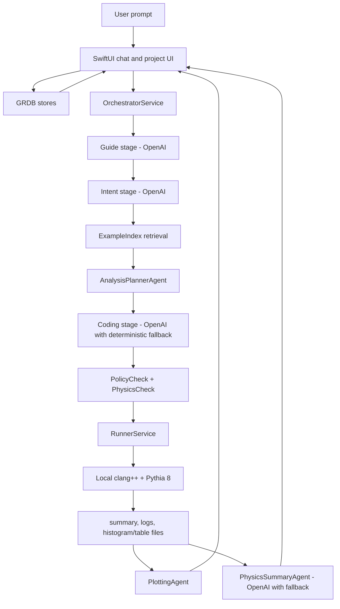

# Vidura Labs Project Orientation

## Current Product

Vidura Labs is a native macOS research companion for particle-physics
simulations. A user can ask a question or request a simulation in natural
language. The app can answer directly, propose a runnable simulation, or run a
local Pythia 8 workflow that generates C++ code, compiles and executes it,
parses artifacts, and renders summary text plus charts in the chat UI.

The long-term direction is a physics-specific research assistant, starting with
HEP and Pythia. macOS is the primary platform. The old CLI and
sponsored-provider hackathon direction is no longer the active baseline.

## Architecture

## Data Model

Persistence is local SQLite through GRDB under Application Support:

- `research_projects`: top-level folders.
- `research_threads`: conversations grouped by project.
- `runs`: execution attempts and chat runs within a thread.
- `messages`: user/assistant/chart messages linked to runs.
- `settings`: single-row user settings table.

Generated simulation artifacts are stored under
`~/Library/Application Support/com.AL.PhysicsCompanion/simulations/<run-id>/`.
Completed runs can now be inspected through Run Evidence, exported as a run
bundle, rerun exactly from persisted source/spec, rerun as a controlled
parameterized variant, compared side by side, and traced back to source runs
through the lineage/reproducibility surface. Completed runs also receive
deterministic Run Quality findings for missing evidence, missing or empty
declared outputs, low event counts, event-count mismatches, histogram overflow
markers, suspicious inclusive/minimum-bias wording, and log warning/error
markers. New completed runs also persist first-pass Physics Reviewer findings
that check final interpretation text against run evidence and deterministic
quality findings. Completed simulation runs also get a deterministic baseline
HEP `reference_pack.json` artifact with typed arXiv, INSPIRE, HEPData, and PDG
references that can be displayed in Run Evidence and included in exports.
Completed runs can explicitly refresh that reference pack from Run Evidence
using bounded arXiv, INSPIRE, HEPData, and PDG retrieval. Refreshed packs store
per-source statuses in `source_statuses` and exports serialize the persisted
pack without live network calls.

## Runtime Pipeline

1. `AppBootstrapView` checks command line tools, installs bundled Pythia into
   Application Support if needed, opens stores, and creates `OrchestratorService`.
2. The chat UI creates or reuses an active run, writes the user message, then
   calls `OrchestratorService.run`.
3. The guide stage uses OpenAI structured output to decide whether to answer,
   propose a simulation, or run one.
4. The intent stage extracts a structured simulation request.
5. `ExampleIndex` retrieves relevant Pythia examples from bundled/installed
   example files.
6. `AnalysisPlannerAgent` builds a deterministic `SimulationSpec`.
7. OpenAI generates Pythia C++ code, with `CodegenAgent` as a deterministic
   fallback for non-rate-limit failures.
8. `PhysicsCheckAgent` and `PolicyCheckAgent` validate generated code.
9. `RunnerService` writes `run.cc`, compiles it with `/usr/bin/clang++`, runs
   it with `PYTHIA8DATA`, captures logs, and parses `summary_lines.txt`.
10. `PlottingAgent` converts artifact files into `ChartPayload`.
11. `PhysicsSummaryAgent` asks OpenAI for final interpretation, falling back to
    a deterministic summary if needed.
12. `PhysicsReviewerAgent` reviews completed-run interpretation against
    evidence, Run Quality findings, chart summaries, and logs, with deterministic
    fallback if model review is unavailable.
13. `HEPReferencePackAssembler` writes a deterministic baseline reference pack
    for completed runs.
14. The user-triggered Refresh References action can update `reference_pack.json`
    from arXiv, INSPIRE, HEPData, and PDG without making normal run completion
    or export depend on network access.

## Supported Analysis Families

- `charged_multiplicity`
- `pt_spectrum`
- `eta_rapidity`
- `invariant_mass`
- `pid_yields`
- `event_scalars`

## Baseline Local Status

The active repository is `https://github.com/akassh9/vidura-labs`.
The canonical local workspace is `/Users/akash009/vidura`. Older public-repo
checkouts were archived under `/Users/akash009/vidura-legacy-archive-*`; verify
remotes before creating branches.

Local development uses a repository-root `.env` with `OPENAI_API_KEY`. The run
script exports `VIDURA_REPO_ROOT` so the app can resolve that file when launched
from Codex.

## Near-Term Cleanup Priorities

1. Add Reference-Grounded Physics Reviewer v2 so reviewer findings consume
   persisted HEP reference packs and flag missing citations, failed source
   coverage, and unsupported external-physics claims.
2. Remove the duplicate `pythia_dist 2` folder and confirm the release bundle
   still includes the expected `pythia_dist` resource.
3. Fix `moveThreadToProject` so it preserves runs/messages instead of
   delete/recreate semantics.
4. Decide where the line should sit between OpenAI-driven codegen and the
   deterministic `CodegenAgent` fallback.
5. Promote the script regression harness into a formal test target once the
   Xcode project structure can absorb that without churn.
